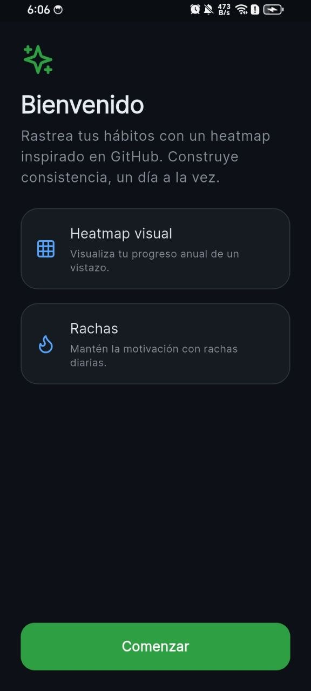
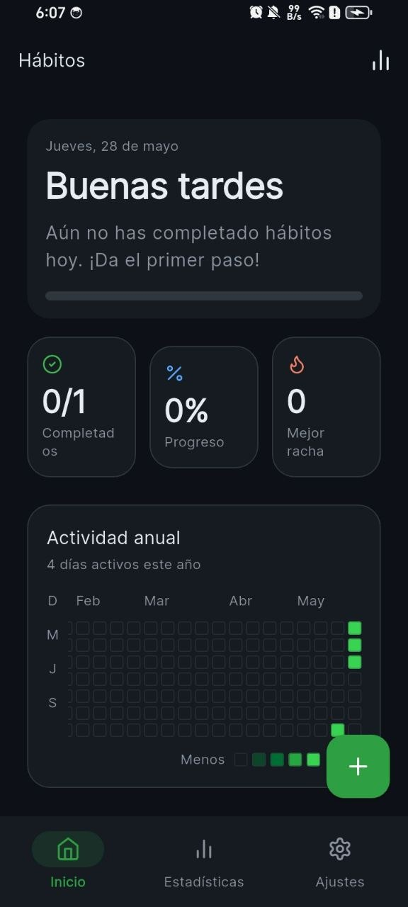
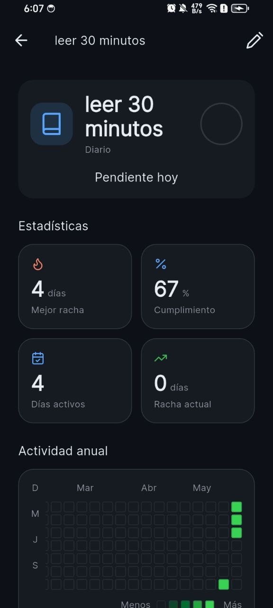
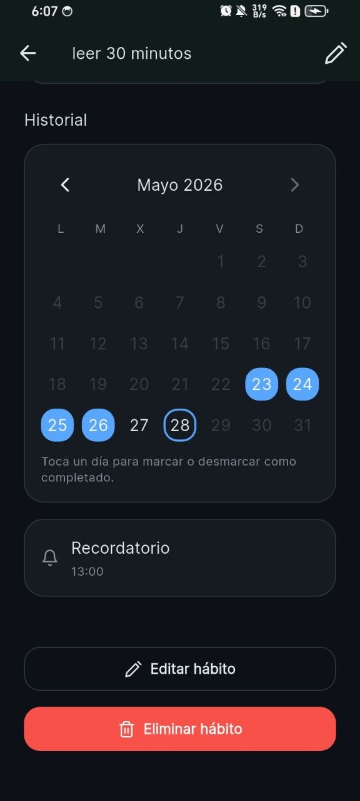
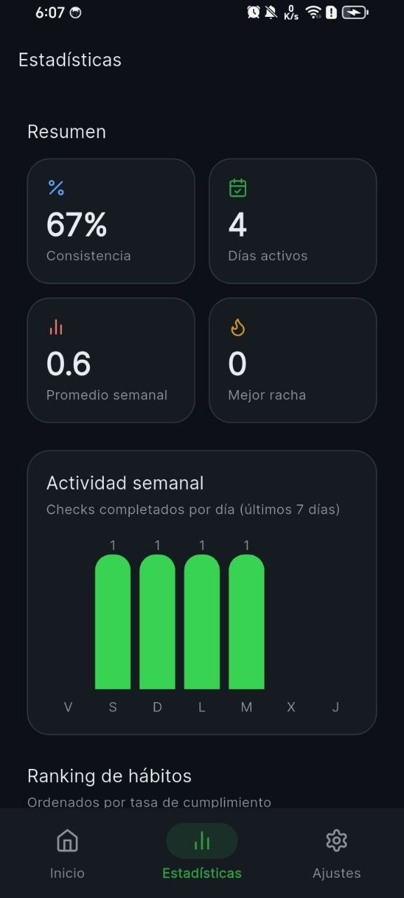
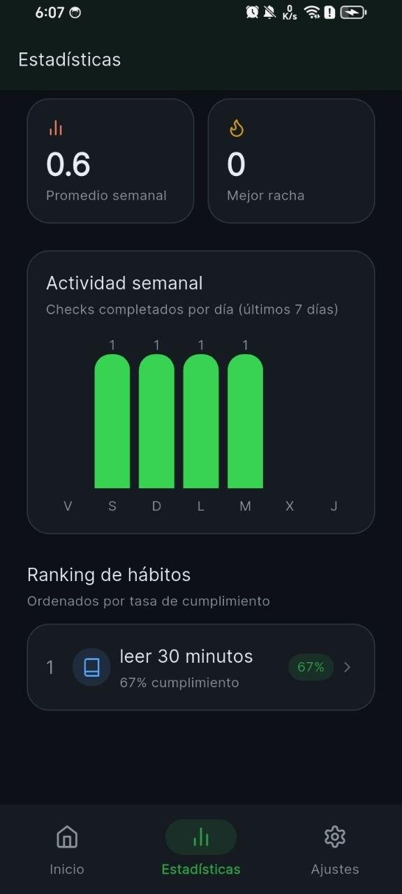
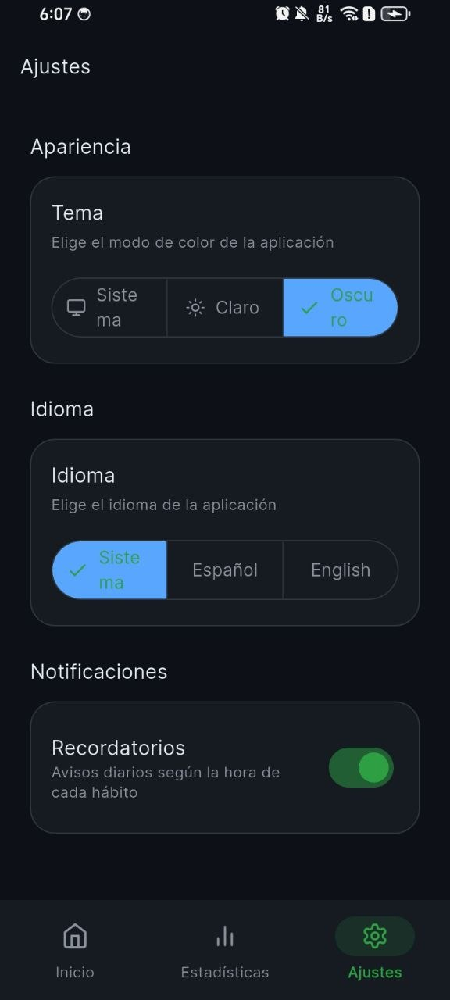

# Habit Tracker Visual

App móvil de seguimiento de hábitos con heatmap estilo GitHub, construida en Flutter. Visualiza tu progreso anual, mantén rachas diarias y consulta estadísticas detalladas por hábito.

## Capturas

| Onboarding | Inicio |
|:---:|:---:|
|  |  |
| Pantalla de bienvenida con las funciones clave | Resumen diario, stats rápidas y heatmap global |

| Detalle del hábito | Historial y recordatorios |
|:---:|:---:|
|  |  |
| Estadísticas, rachas y heatmap por hábito | Calendario interactivo, recordatorio y acciones |

| Estadísticas | Ranking de hábitos |
|:---:|:---:|
|  |  |
| Resumen, consistencia y actividad semanal | Comparativa de cumplimiento entre hábitos |

| Ajustes |
|:---:|
|  |
| Tema, idioma y recordatorios configurables |

## Características

- **Heatmap anual** — Cuadrícula de contribuciones al estilo GitHub, global y por hábito
- **Rachas y cumplimiento** — Mejor racha, racha actual y porcentaje de cumplimiento
- **Estadísticas globales** — Consistencia, días activos, promedio semanal y gráfico de los últimos 7 días
- **Calendario mensual** — Marca o desmarca días completados con un toque
- **Recordatorios locales** — Notificaciones diarias según la hora de cada hábito
- **Personalización** — Tema claro/oscuro/sistema e idioma español/inglés
- **Persistencia local** — Datos almacenados en el dispositivo con Hive

## Stack

| Categoría | Tecnología |
|---|---|
| Framework | Flutter + Dart |
| Estado | Riverpod |
| Navegación | GoRouter |
| Almacenamiento | Hive |
| Notificaciones | flutter_local_notifications |
| UI | Google Fonts (Inter), Lucide Icons, flutter_animate |
| i18n | flutter_localizations (ES / EN) |

## Arquitectura

Feature-first con capas ligeras:

```text
lib/
├── app.dart
├── main.dart
├── core/
│   ├── router/
│   └── theme/
├── features/
│   ├── splash/
│   ├── onboarding/
│   ├── home/
│   ├── heatmap/
│   ├── statistics/
│   ├── settings/
│   ├── create_habit/
│   ├── habit_detail/
│   └── habits/
└── shared/
    └── widgets/
```

## Requisitos

- [Flutter SDK](https://docs.flutter.dev/get-started/install) ^3.8.0
- Un emulador o dispositivo Android / iOS / Windows / macOS / Linux / Web

## Ejecutar

```bash
flutter pub get
flutter run
```

Para generar un APK de debug:

```bash
flutter build apk --debug
```

## Plan de desarrollo

Ver [plan.md](plan.md) para el roadmap completo (PR-01 a PR-14).
